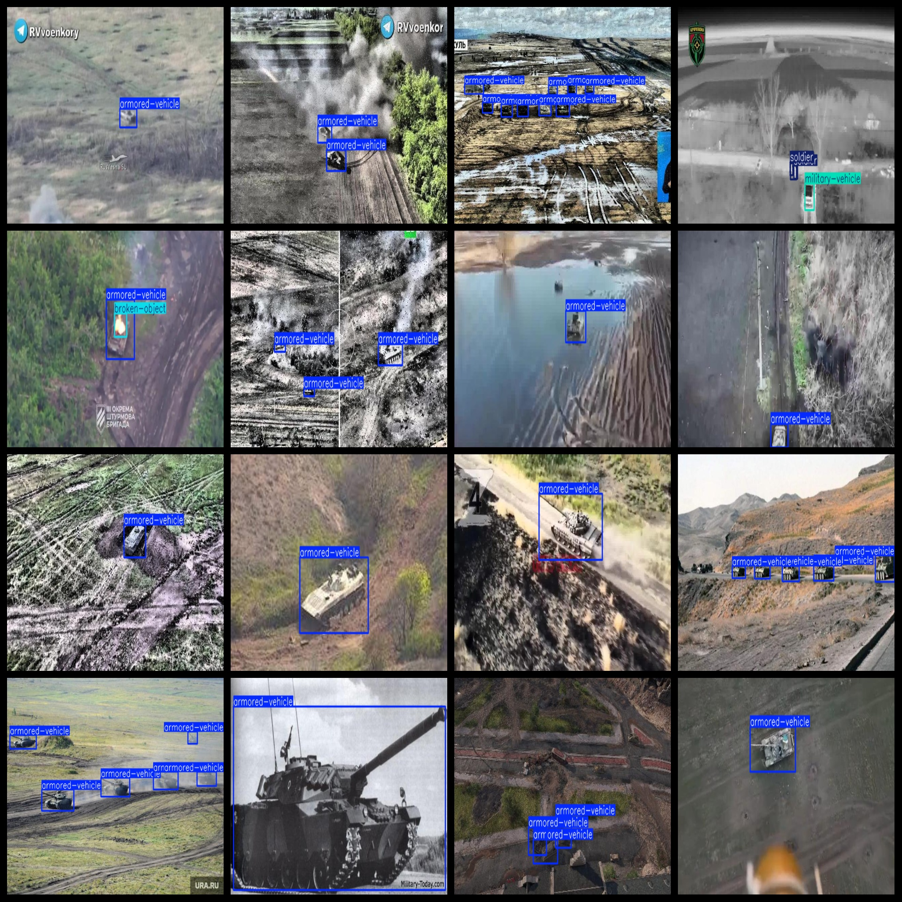
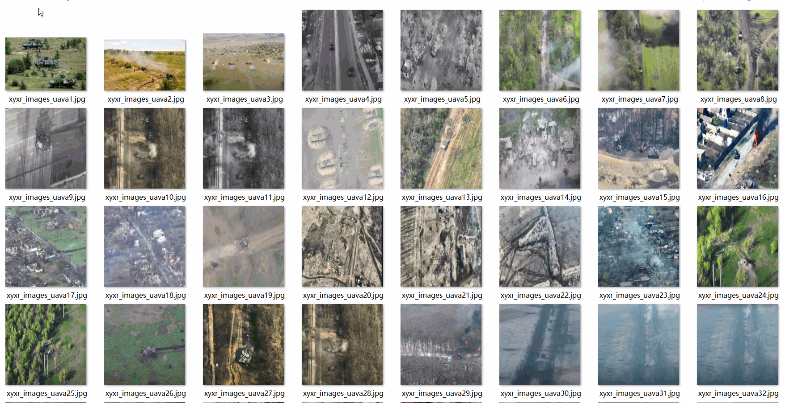

# Military Target Detection Dataset 9758 imagesVOC+YOLO format

The dataset for military target detection includes 9758 images in VOC+YOLO format.

Dataset format: Pascal VOC format + YOLO format (the txt file does not contain the split path, it only contains jpg images and corresponding VOC format xml files and yolo format txt files)

Number of images (jpg file count): 9758

Labeled quantity (number of xml files): 9758

Number of annotations (number of txt files): 9758

Number of callout categories: 5

The Github repository is: datasets_sl

["armored-vehicle", "broken-object", "building", "military-vehicle", "soldier"]

Number of boxes labeled in each category:

Armored-vehicle Frames = 17337 (armoured vehicle or tank)

Broken-object Frames = 767 (Broken Objects)

The number of building frames = 686 (housing construction)

Military-vehicle Frame Count = 1723 (military vehicles)

The number of soldiers is 3462.

Total Frames: 23975

Number of images per category:

Armored-vehicle occupies 7753 images.

Broken Object Ownership Count = 752

Building occupancy = 177

Number of military vehicle images = 906

Soldier's possession count = 1049

Image resolution: 640x360

Use the labeling tool: labelImg

Dataset Augmentation: No

Rules for annotation: Draw a rectangle around the category.

Important note: Dataset without split training validation test collect need to do it yourself split ，Dataset Image large Part as Aerial view

Special Disclaimer: This dataset does not guarantee the accuracy of the trained models or weight files.

Annotation and image details are as follows:

## Images

---

Here is a pay link on Stripe (https://buy.stripe.com/3cs8yP7sY87d0vu9AB). Please contact me lonlonago@foxmail.com after funding $89, and I will send you a complete data files, thank you!

